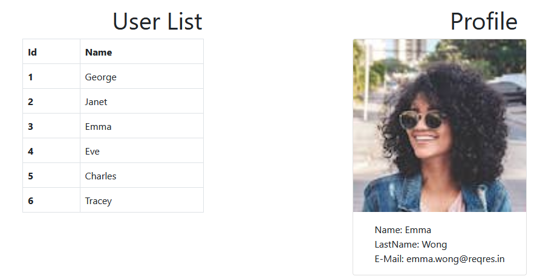

# useContext funcionamiento

_Utilizacion del useContext con una simple api y mostrarlo en distintos componentes.-_

## Comenzando 🚀

_Cloar el proyecto_

### Pre-requisitos 📋

_Solo necesitas poder usar react y tienes que tener instalado Node para poder correrlo _

### Instalación 🔧

_npm install_

_npm start_

_http://localhost:3000/_

Menciona las herramientas que utilizaste para crear tu proyecto

    npx create-react-app Base Biblioteca de Javascript para construir interfaces de Usuarios
    bootstrap framework front-end para desarrollar aplicaciones web

